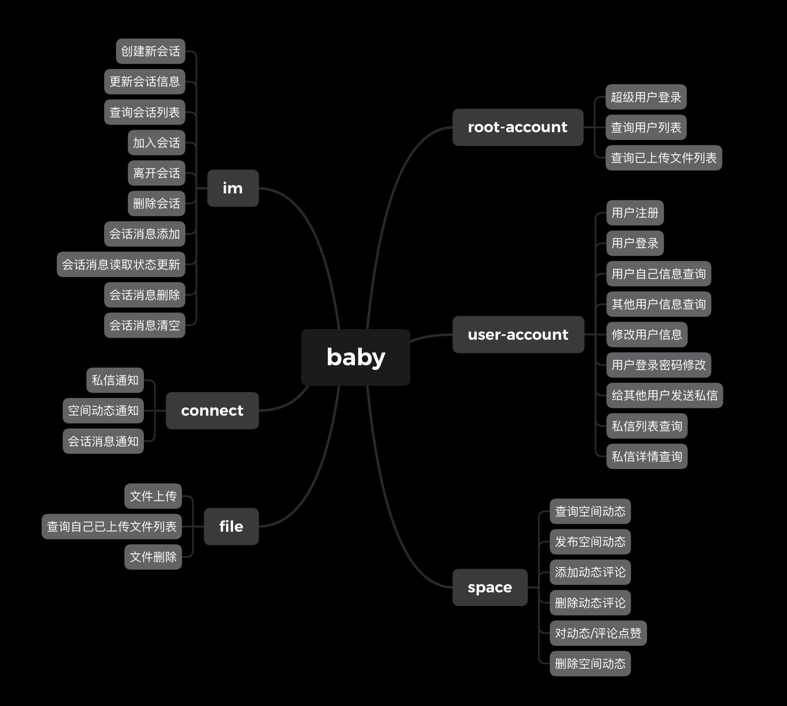
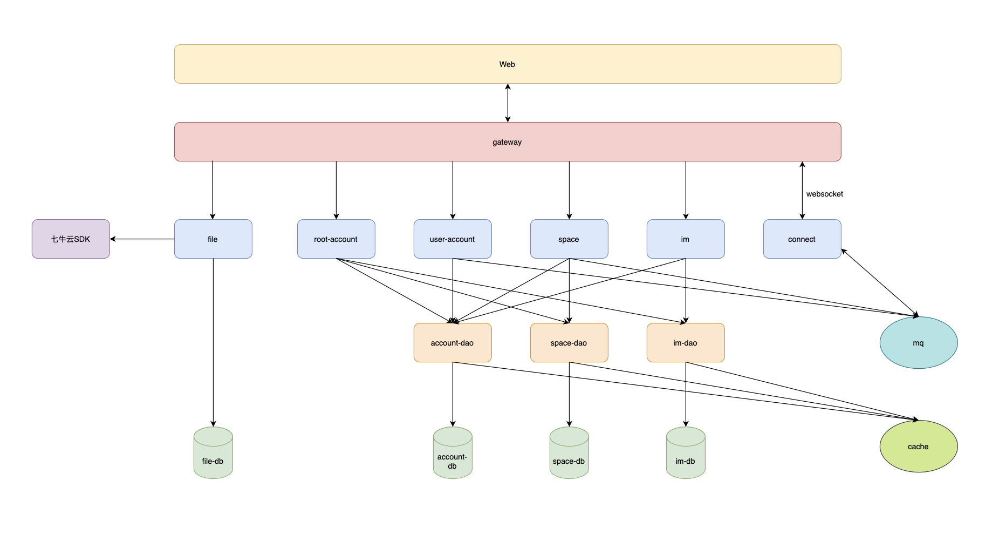

# baby-fried-rice

## 简介

baby-fried-rice（宝宝煎米果，以下简称baby）是一套由Go语言开发，以用户中心、即时通信、用户空间三个模块为主的分布式微服务后台系统。使用了Gin作为Web框架，Gorm为连接数据库的ORM框架，JWT实现Token验证。服务之间的调用通过gRPC的方式进行，为了方便每个微服务的横向扩展，引入了ETCD作为服务注册中心。使用了NSQ作为消息队列转发消息，引入Redis做热点数据缓存。使用了七牛云云存储服务存储照片、文件等内容。

## 业务内容

如下图所示，服务整体包含六个部分，每个部分的功能描述如下：

* root-account：超级用户接口管理，主要是查询一些整体上的用户数、文件上传到七牛云的列表等信息，后期可能会实现pv、uv的统计；
* user-account：用户中心模块的实现，包括用户的登录、注册、信息查询修改、私信管理等，后期会引入用户等级、积分管理；
* space：用户空间模块的实现，包括用户动态发布、查询和删除，用户点赞，用户评论等；
* im：聊天模块的实现，包括会话的管理和会话消息的管理，后期引入好友管理；
* connect：消息通知模块的管理，包括用户私信通知、空间动态通知、会话消息通知；
* file：文件模块的管理，包括文件上传、查询和删除；



## 微服务架构



## 运行

* 运行etcd、nsq、redis、mysql服务

```shell
## 运行基础服务
./bin/baby-docker-base-run.sh up
```

* 微服务编译运行

```shell
## 编译
make build
## 运行
make run
## 清空编译文件
make clean
```

* docker容器运行

```shell
## 编译业务服务镜像
./bin/baby-docker-build.sh
## 业务服务启动
./bin/baby-docker-run.sh up
## 关闭所有服务
./bin/baby-docker-run.sh down
```

## 开源技术列表
* [Golang](https://github.com/golang/go)
* [Gin](https://github.com/gin-gonic/gin)
* [Gorm](https://github.com/go-gorm/gorm)
* [Redis](https://github.com/redis/redis)
* [NSQ](https://github.com/nsqio/nsq)
* [ETCD](https://github.com/etcd-io/etcd)
* [Docker](https://github.com/moby/moby)